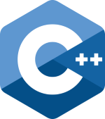

# Дополнительные материалы к курсу "Углубленное программирование на C/C++"

1. [Работа с компилятором](compiler.md)
2. [Работа с Valgrind](valgrind.md)
3. [Отладка программ с помощью GDB](gdb-intro.md)
